# &nbsp;w3w-android-design-library

## Introduction

A Jetpack compose design library to be used across what3words components and apps.

## Installation

The artifact is available
through [](https://search.maven.org/search?q=g:%22com.what3words%22%20AND%20a:%22w3w-android-design-library%22)

### Android minimum SDK support

[](https://developer.android.com/about/versions/nougat)

### Gradle

```
implementation 'com.what3words:w3w-android-design-library:1.0.0'
```

# Design library components

### [SuggestionWhat3words](https://github.com/what3words/w3w-android-design-library/blob/main/design-library/src/main/java/com/what3words/design/library/ui/components/SuggestionWhat3words.kt) 

A list item that contains a what3words address information.

<p float="left">
    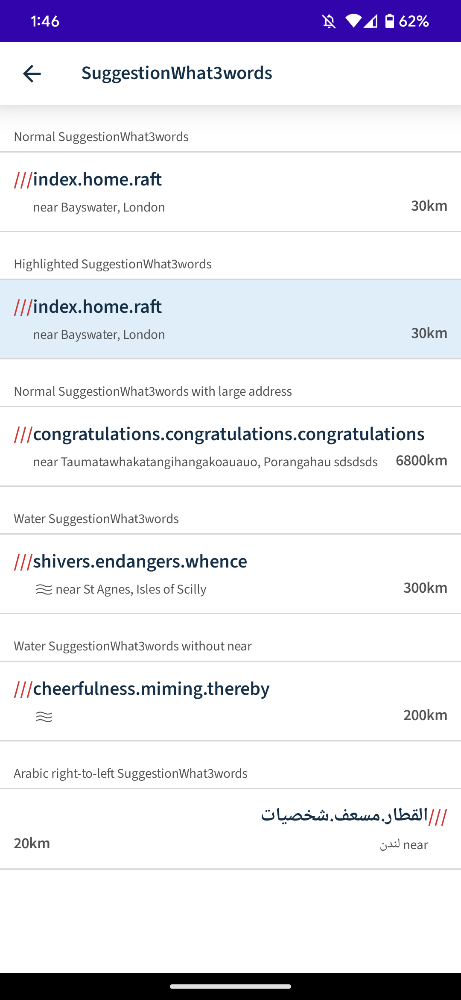
    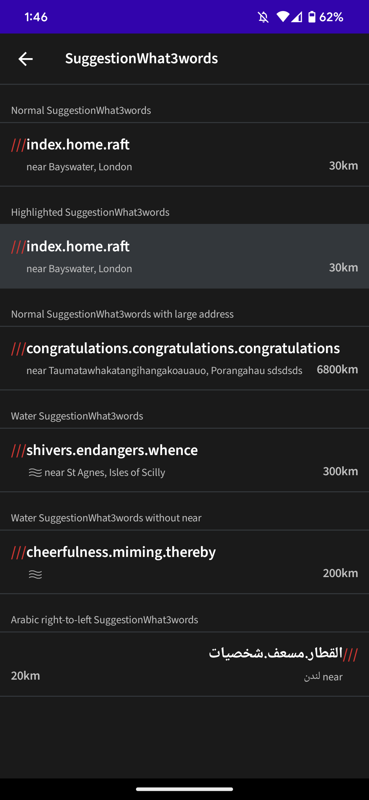
</p>

#

### [SuggestionGeolocation](https://github.com/what3words/w3w-android-design-library/blob/main/design-library/src/main/java/com/what3words/design/library/ui/components/SuggestionGeolocation.kt) 

A list item that contains a geolocation leaf or non-leaf node, with a mandatory primary address and an optional secondary address.

<p float="left">
    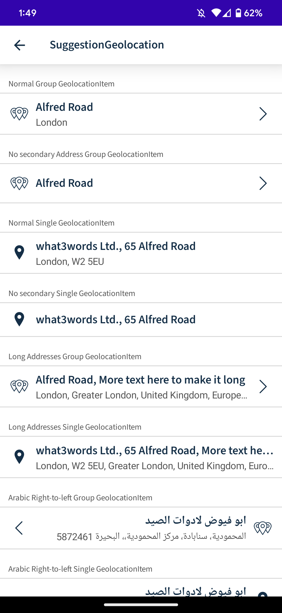
    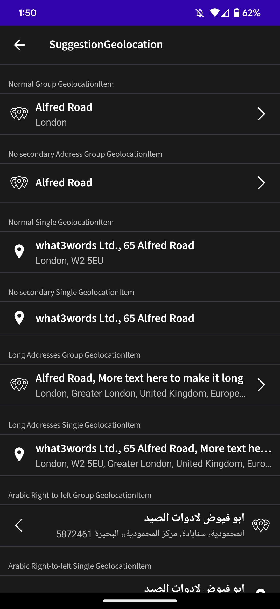
</p>

#

### [ListItemAction](https://github.com/what3words/w3w-android-design-library/blob/main/design-library/src/main/java/com/what3words/design/library/ui/components/ListItemAction.kt) 

A list item that contains an action of the type RadioGroup, Checkbox or Toggle.

<p float="left">
    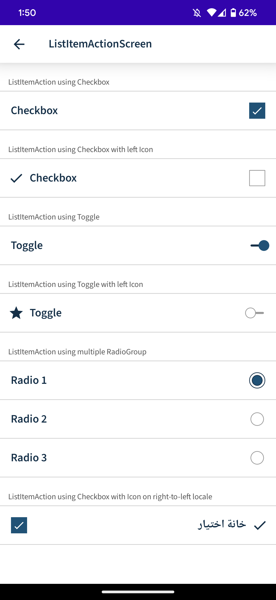
    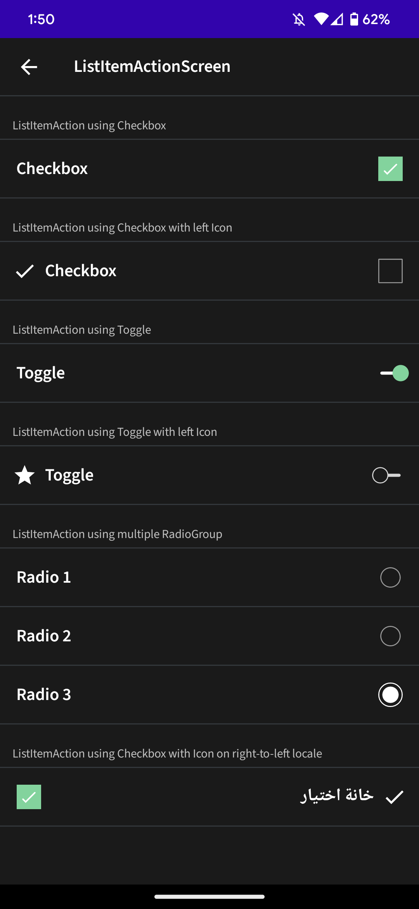
</p>

#

### [ListItemNavigation](https://github.com/what3words/w3w-android-design-library/blob/main/design-library/src/main/java/com/what3words/design/library/ui/components/ListItemNavigation.kt) 

A list item that navigates to a different screen/action.

<p float="left">
    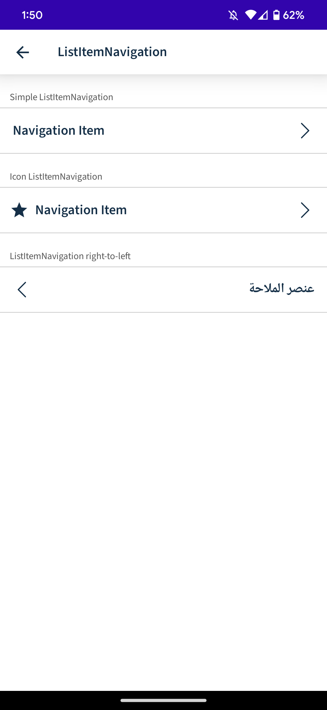
    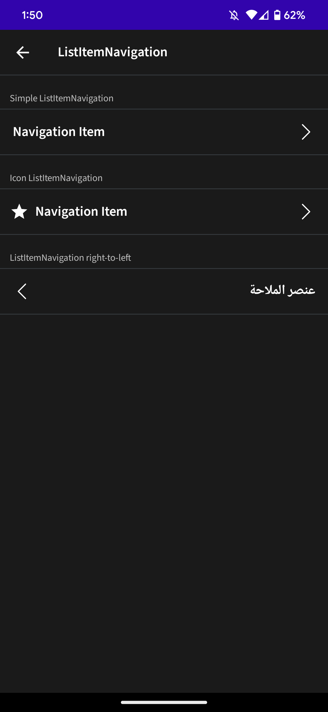
</p>

#

### [FormField](https://github.com/what3words/w3w-android-design-library/blob/main/design-library/src/main/java/com/what3words/design/library/ui/components/FormField.kt) 

A TextField to be used in What3words apps and demo apps that can be easily styled to look highly integrated within any app.

<p float="left">
    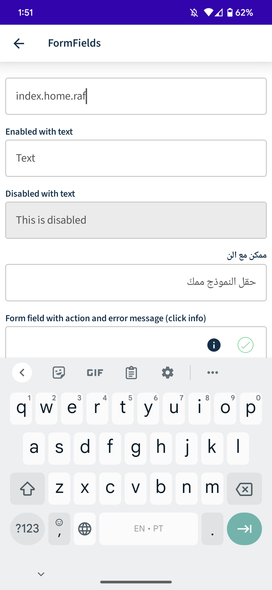
    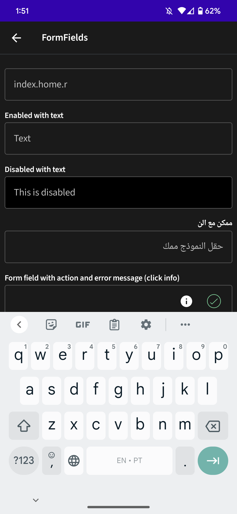
</p>

#

### [Buttons](https://github.com/what3words/w3w-android-design-library/blob/main/design-library/src/main/java/com/what3words/design/library/ui/components/Buttons.kt) 

A set of buttons to be used on our internal what3words and sample apps, we have PrimaryButton, SecondayButton, TertriaryButton, TextButton and OutinedButton with three different sizes and with an optional start icon.

<p float="left">
    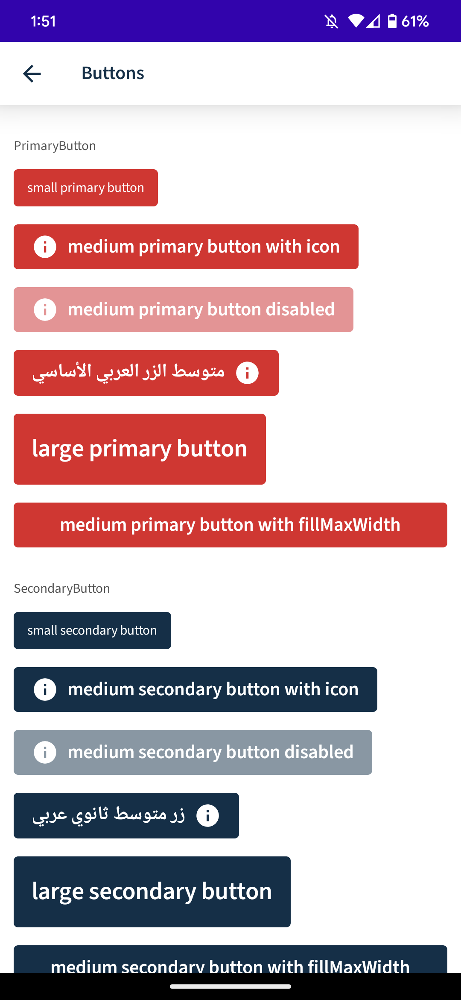
    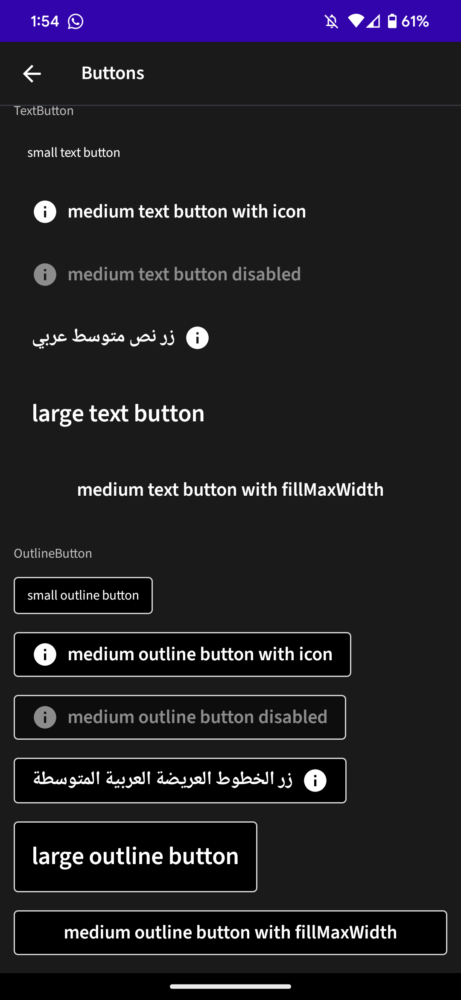
</p>

#

### [IconButtons](https://github.com/what3words/w3w-android-design-library/blob/main/design-library/src/main/java/com/what3words/design/library/ui/components/IconButtons.kt) 

A set of icon buttons to be used on our internal what3words and sample apps, we have FilledIconButton, GhostFilledIconButton and OutlinedIconButton with three different sizes.

<p float="left">
    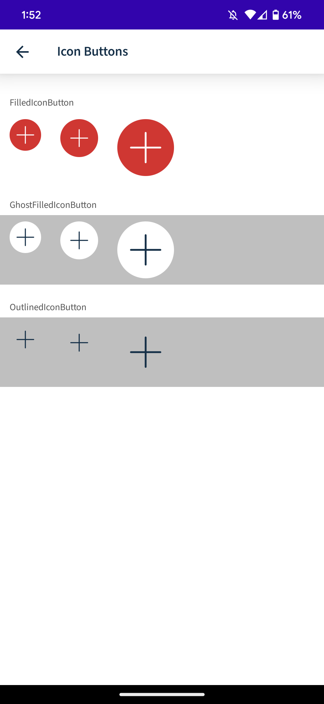
    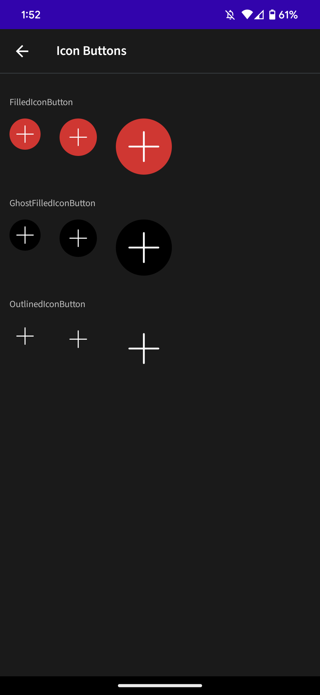
</p>

#

### [Notification](https://github.com/what3words/w3w-android-design-library/blob/main/design-library/src/main/java/com/what3words/design/library/ui/components/Notification.kt) 

A notification component with the following types Information, Error, Warning or Confirmation.

<p float="left">
    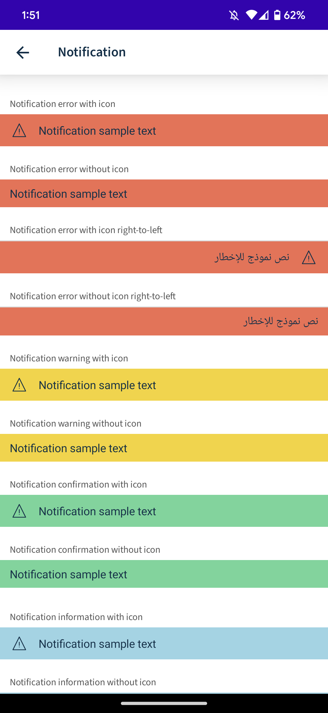
    
</p>