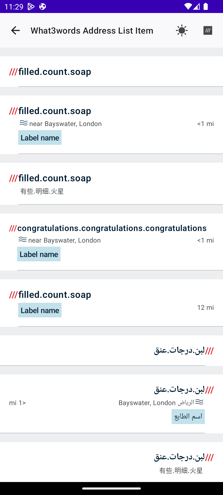
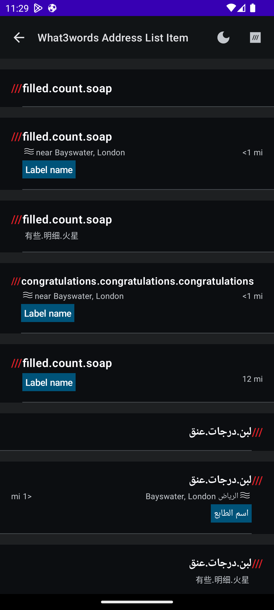
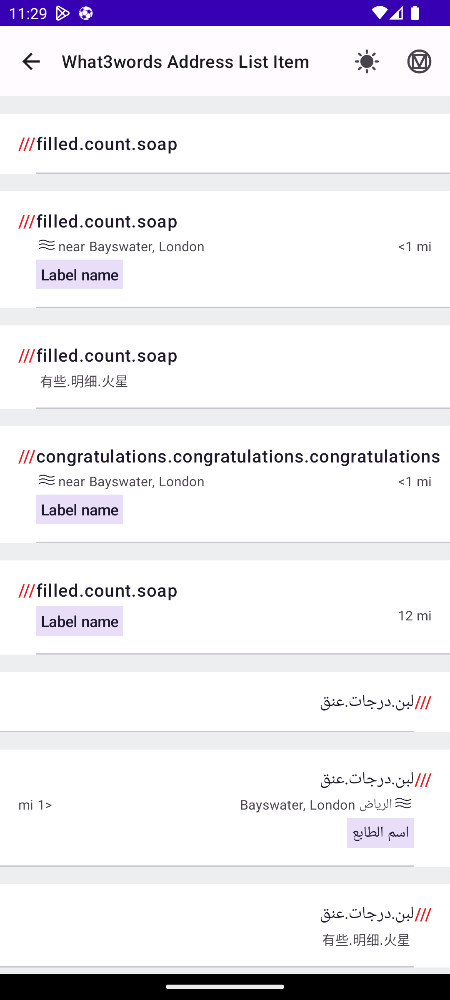
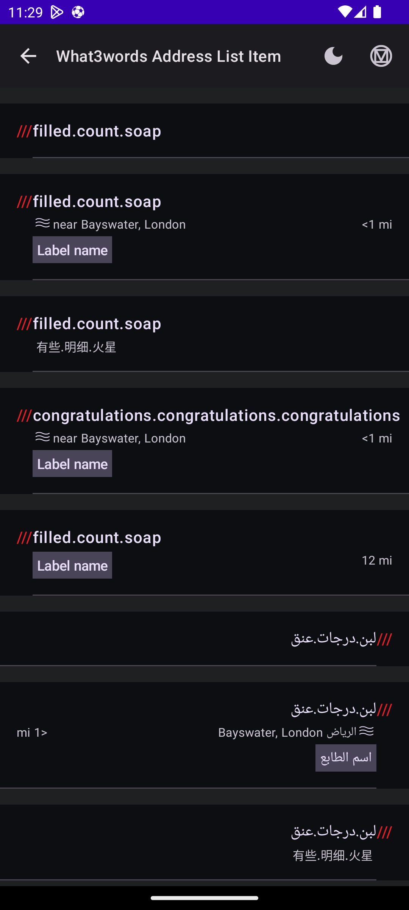
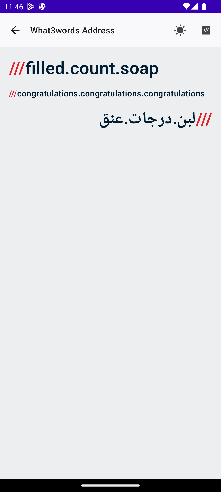
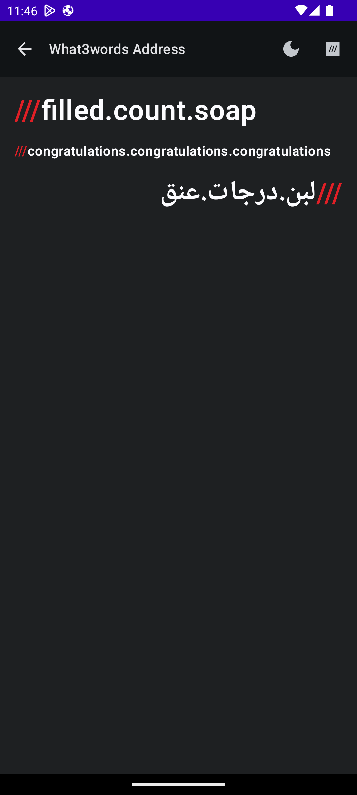
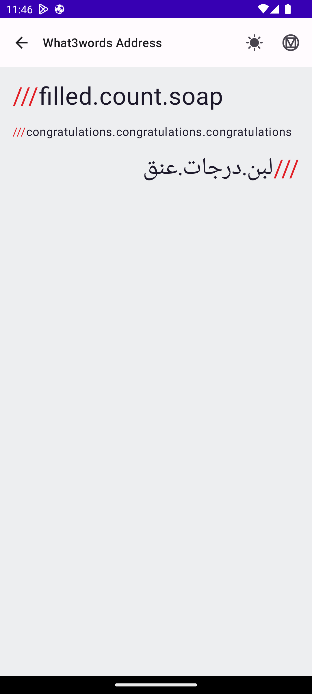
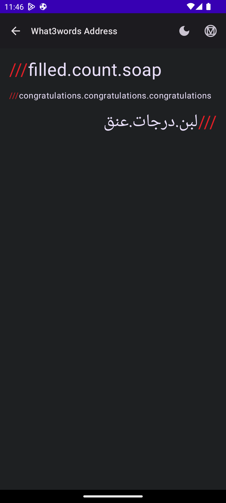

# &nbsp;w3w-android-design-library

## Introduction

A Jetpack compose design library based on Material3 to be used across what3words components and apps.

## Installation

The artifact is available 
through [](https://central.sonatype.com/artifact/com.what3words/w3w-android-design-library/)

### Android minimum SDK support

[](https://developer.android.com/about/versions/nougat)

### Gradle

```
implementation 'com.what3words:w3w-android-design-library:2.0.0'
```

# Design library components

### [What3wordsAddressListItem](https://github.com/what3words/w3w-android-design-library/blob/main/design-library/src/main/java/com/what3words/design/library/ui/components/What3wordsAddressListItem.kt)

Composable function to display a list item representing a What3words address.  This composable provides a customizable and responsive way to display What3words address suggestions in a list with optional details such as nearest place, distance, and custom labels.

###### W3W Theme

<p float="left">
    
    
</p>

###### Material Theme

<p float="left">
    
    
</p>

### [What3wordsAddress](https://github.com/what3words/w3w-android-design-library/blob/main/design-library/src/main/java/com/what3words/design/library/ui/components/What3wordsAddress.kt)

What3words Address is a composable to display a What3words address. It offers customizable styles for text and colors, and utilizes responsive text to adjust to container sizes.

###### W3W Theme

<p float="left">
    
    
</p>

###### Material Theme

<p float="left">
    
    
</p>

# 

### [ListItemAction](https://github.com/what3words/w3w-android-design-library/blob/main/design-library/src/main/java/com/what3words/design/library/ui/components/ListItemAction.kt)

A list item that contains an action of the type RadioGroup, Checkbox or Toggle.

<p float="left">
    
    
</p>

# 

### [ListItemNavigation](https://github.com/what3words/w3w-android-design-library/blob/main/design-library/src/main/java/com/what3words/design/library/ui/components/ListItemNavigation.kt)

A list item that navigates to a different screen/action.

<p float="left">
    
    
</p>

# 

### [FormField](https://github.com/what3words/w3w-android-design-library/blob/main/design-library/src/main/java/com/what3words/design/library/ui/components/FormField.kt)

A TextField to be used in What3words apps and demo apps that can be easily styled to look highly integrated within any app.

<p float="left">
    
    
</p>

# 

### [Buttons](https://github.com/what3words/w3w-android-design-library/blob/main/design-library/src/main/java/com/what3words/design/library/ui/components/Buttons.kt)

A set of buttons to be used on our internal what3words and sample apps, we have PrimaryButton, SecondayButton, TertriaryButton, TextButton and OutinedButton with three different sizes and with an optional start icon.

<p float="left">
    
    
</p>

# 

### [IconButtons](https://github.com/what3words/w3w-android-design-library/blob/main/design-library/src/main/java/com/what3words/design/library/ui/components/IconButtons.kt)

A set of icon buttons to be used on our internal what3words and sample apps, we have FilledIconButton, GhostFilledIconButton and OutlinedIconButton with three different sizes.

<p float="left">
    
    
</p>

# 

### [Notification](https://github.com/what3words/w3w-android-design-library/blob/main/design-library/src/main/java/com/what3words/design/library/ui/components/Notification.kt)

A notification component with the following types Information, Error, Warning or Confirmation.

<p float="left">
    
    
</p>
